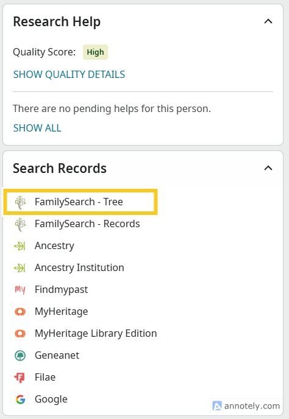
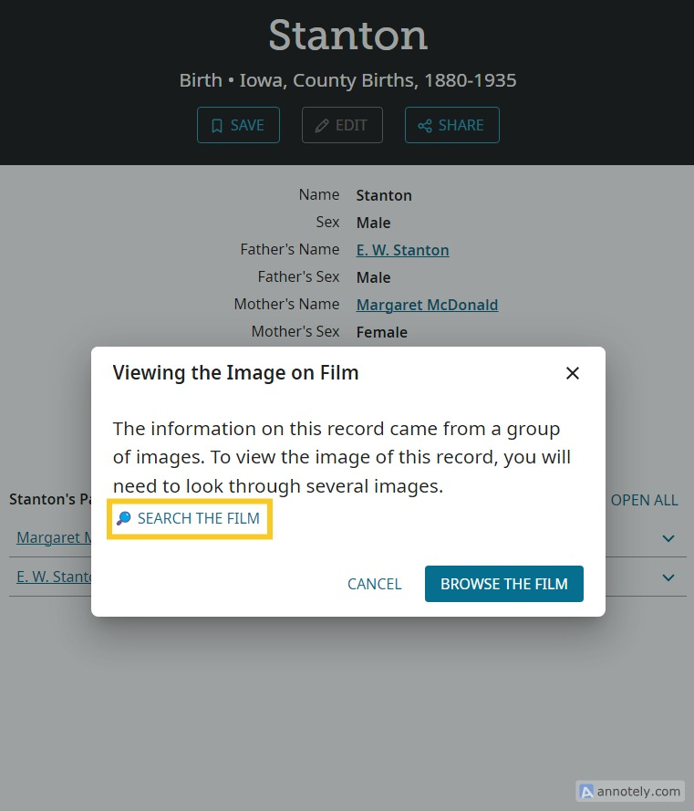
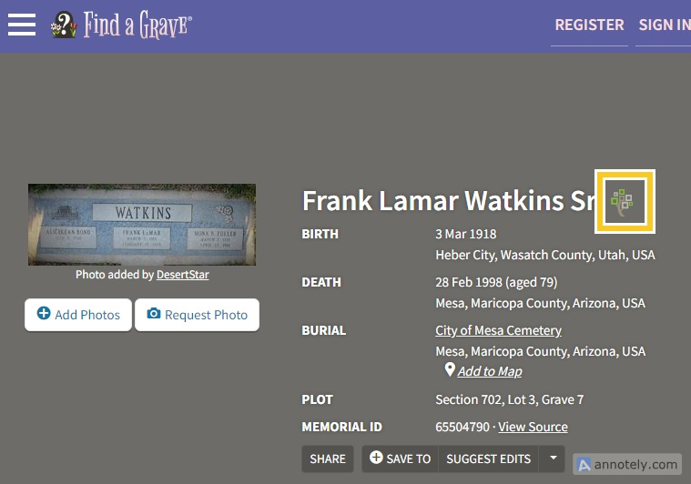

# FamilySearch Army Knife

This is a Tampermonkey/GreaseMonkey script that adds extra functionality to make it easier to work on FamilySearch.org.

This is my own personal project is not based off FamilySearch source code or associated with FamilySearch in any way.

## Installation

1. Install Tampermonkey or Greasemonkey in your browser if you haven't already.
2. Click [here](https://github.com/matthewpwatkins/fs-army-knife/releases/latest/download/fs-army-knife.user.js) to install the latest version of the script.

That's it!

## Features

### Search for possible duplicates in the tree from the person view

FamilySearch already allows you to easily search for records within FamilySearch from within the person view. I've also added a button to search the tree for duplication people from the person view.

### Full-text search

Full-text search is an amazing tool, allowing you to search for text within microfilm, books, and other previously unsearchable imagesin FamilySearch. You must [enable full-text search on your account](https://www.familysearch.org/en/labs/) to use this feature. When you're viewing a record match, you will see a link to open the full-text search for that person's name in that record, saving you the work of hunting through images manually.

Or if you are already viewing a film or other record, you can access full-text search from the film details page:

### Go to FamilySearch directly from FindAGrave

If you're on FindAGrave memorial page, a button shows that directly links you to the corresponding FindAGrave record in FamilySearch, saving you the work of searching for the person manually.

### Copy FamilySearch session ID

This is for the developers. It adds a menu item to Tampermonkey to copy your FamilySearch session ID to the clipboard so you don't have to grab it out of your cookies yourself.

## Suggestions

If you want to suggest new features, reach out to me at [watkins.dev](https://watkins.dev).

## Developing locally

1. Clone the repository
2. `npm install`
3. `npm run build`
4. The `.user.js` script is output to the dist folder.

## Releases

Just push or pull request into master to create a new release.
