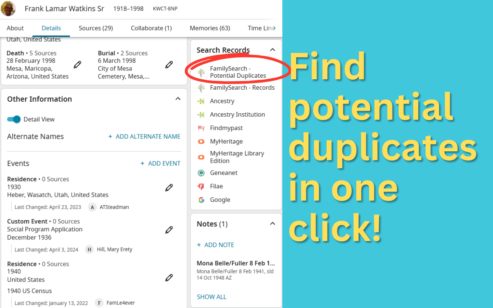
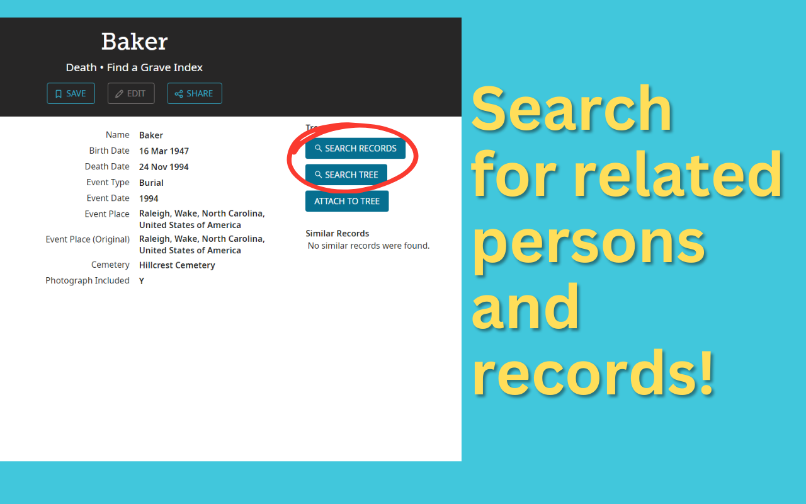
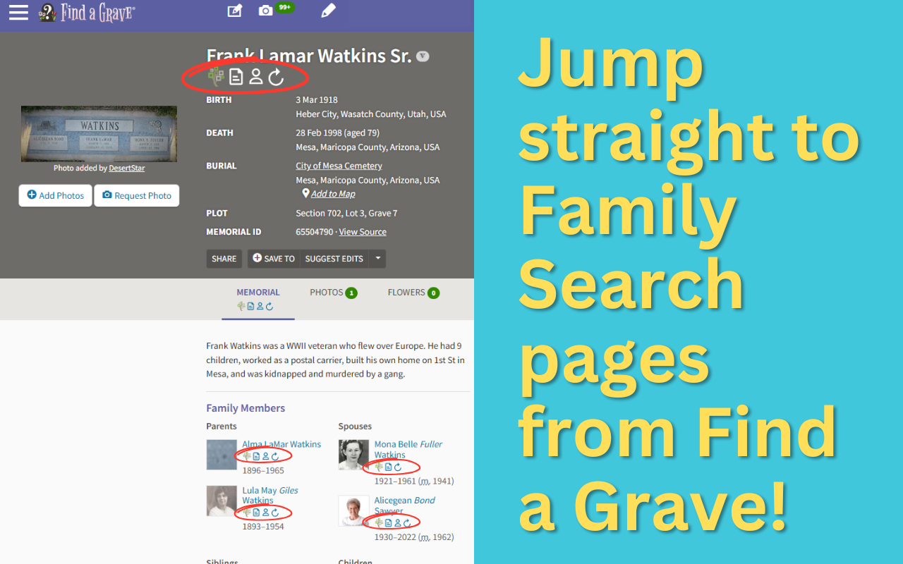

#  FS Tools

This is a Chrome / Edge extension that adds extra functionality to make it easier to work on FamilySearch.org and integrate to other geneaoly sites.

**NOTE:** This is my own personal project is not based off FamilySearch source code or associated with FamilySearch in any way.

## Installation

Install the extension from your browser's extension or add-on list:

- [Chrome](https://chromewebstore.google.com/detail/fs-tools/mdkonnbiomkkmccchabmcjgocnbpokah)
- Edge (use the Chrome link)
- Brave (use the Chrome link)
- DuckDuckGo (use the Chrome link)
- Opera (use the Chrome link)
- Firefox (coming soon)
- Safari (coming soon)

## Features

FS Tools adds several helpful features to FamilySearch.org, FindAGrave.com, and other helpful genealogical research sites to improve your FamilySearch tree-building experience. Features:

### One-click search for potential duplicates

Sometimes there is another version of the person you are working on somewhere else in the tree. But you won't see a "Possible duplicate" hint on that person unless the system is *very* confident. Experienced users know to go search the tree to see if there is another version of that person somewhere in the tree. Constructing this search takes time.

FS Tools adds a link to the records section of the page that builds that search for you based on the information on the page. You can check for potential duplicates with a single click!

### Search from record

When you're looking at a record on FamilySearch and the record isn't attached as a source to a person, the system helpfully shows you a list of what it thinks might be related records along the side. But this is a very short list. And it only shows if the record isn't attached. If you want to search the tree or other records based on the information of a record, you currently have to open up a search window (one for records and one for the tree) and type all the information from the record.

FS Tools adds links to the record to automatically perform a search of the records or tree system based on the information present in the record you're looking at.

### Full-text search on films

FamilySearch added [a new labs feature called "Full-Text Search"](https://www.familysearch.org/en/labs/) that leverages the power of AI to search films and other images for text. This is especially helpful when you want to read a record from a microfilm scan but the page number is not included in the record. But opening the full-text search tool and building the search parameters for your film is tricky.

FS Tools adds a full-text search box to all film records, allowing you to quickly jump right to the page you want!

### Find-a-Grave integration

When browsing Find-a-Grave, FS Tools adds icons linking you from the grave memorial to the corresponding record in FamilySearch. If you have already logged into FamilySearch in your browser, it will even show you whether there is already a person in the tree for that grave record!

### More features to come

FS Tools is a new extension, and I'm adding features all the time. If you think of an idea you'd like to see, contact me at watkins.dev!

## Developing locally

1. Clone the repository
2. `npm install`
3. `npm run build`
4. Open a Chromium-based browser (Chrome, Edge, Opera)
5. Go to `chrome://extensions`
6. Enable Developer Mode (if not enabled already)
7. Click "Load unpacked" and select the `dist` directory in the repository.
